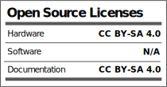

# Soldering_Tutorial_Kits

The Soldering Tutorial Kits boards are designed to help people learn to solder SMD components with lots of repetition and a fair quantity of cheap and available parts. Their goal is to give one the confidence and skills needed to work on more demanding professional or hobby projects.

Those parts will be used as a part of an Beginner SMD Tutorial Corse. 

# License

  

The project is released under the [Creative Commons Attribution-ShareAlike 4.0 International (CC BY-SA 4.0)](https://creativecommons.org/licenses/by-sa/4.0/).

Note: This is a human-readable summary of (and not a substitute for) the [license](https://creativecommons.org/licenses/by-sa/4.0/legalcode).